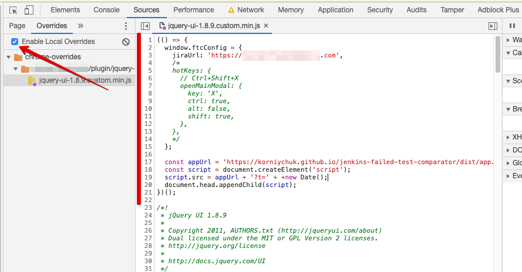
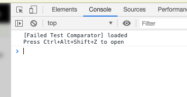
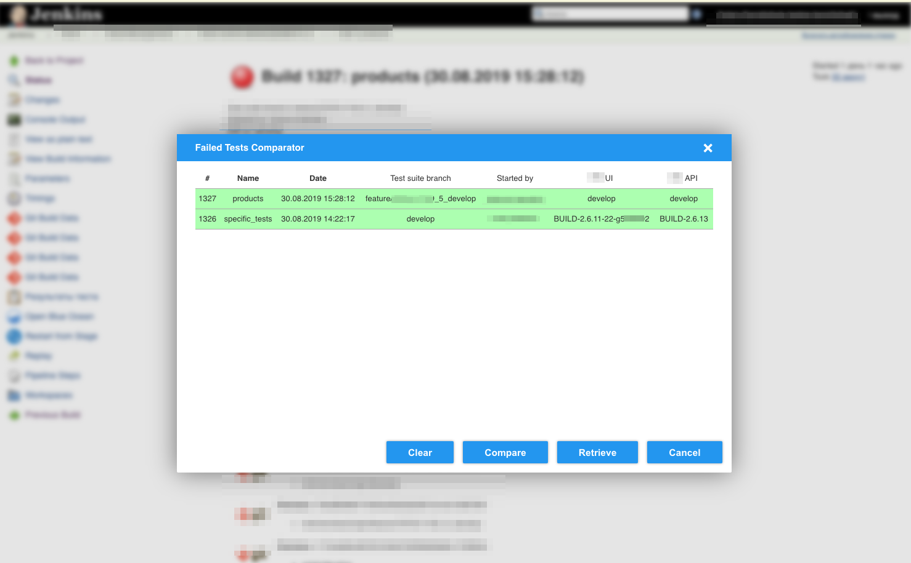
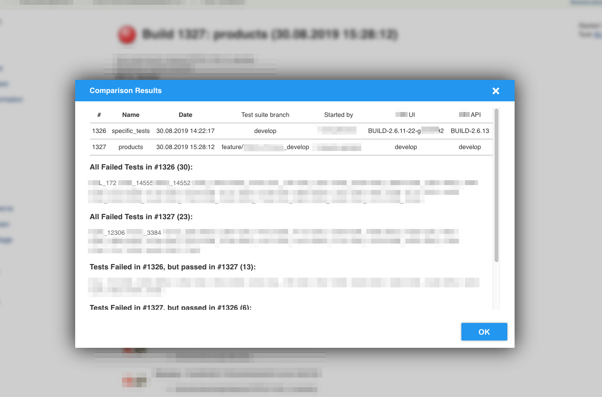

# jenkins-failed-test-comparator

Default Hot Key: `Ctrl + Alt + Shift + Z` 

```javascript
(() => {
  window.ftcConfig = {
    jiraUrl: 'https://my-jira-domain.com',
    /*
    hotKeys: {
      // Ctrl+Shift+X
      openMainModal: {
        key: 'X',
        ctrl: true,
        alt: false,
        shift: true,  
      },
    },
    */
  };
  
  const appUrl = 'https://korniychuk.github.io/jenkins-failed-test-comparator/dist/app.js';
  const script = document.createElement('script');
  script.src = appUrl + '?t=' + +new Date();
  document.head.appendChild(script);
})();
```





